# Lian_Yu — TryHackMe write-up

**Platform:** [TryHackMe](https://tryhackme.com/room/lianyu)  
**Difficulty**: Easy
**Focus:** web enumeration, encoded clues, FTP, file signatures, steganography, SSH, sudo privilege escalation

## Summary

The website revealed a hidden code word and a `.ticket` clue. Decoding the ticket gave me access to FTP, where I found an image with a damaged PNG signature and a JPEG containing an embedded ZIP file. The extracted files led to an SSH login as `slade`. A `sudo` rule for `pkexec` then allowed a root shell..

## 1. Reconnaissance

I started with a scan of all TCP ports, service version detection, and Nmap's default scripts:

```bash
TARGET='10.81.141.27'  # Replace with your current lab IP
nmap -Pn -sV -sC -p- --open "$TARGET"
```

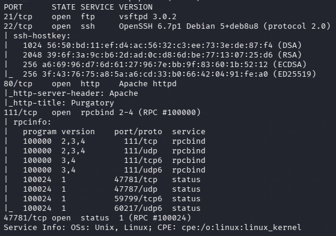

| Port      | Service      | Next step                             |
| --------- | ------------ | ------------------------------------- |
| 21/tcp    | FTP          | Check whether anonymous access works. |
| 22/tcp    | SSH          | Keep in mind if credentials turn up.  |
| 80/tcp    | HTTP         | Inspect the site and enumerate paths. |
| 111/tcp   | `rpcbind`    | No useful lead.                       |
| 47781/tcp | Unidentified | No useful lead.                       |

I tried anonymous FTP and was denied, then focused on HTTP. The landing page introduced the room's Arrowverse theme.

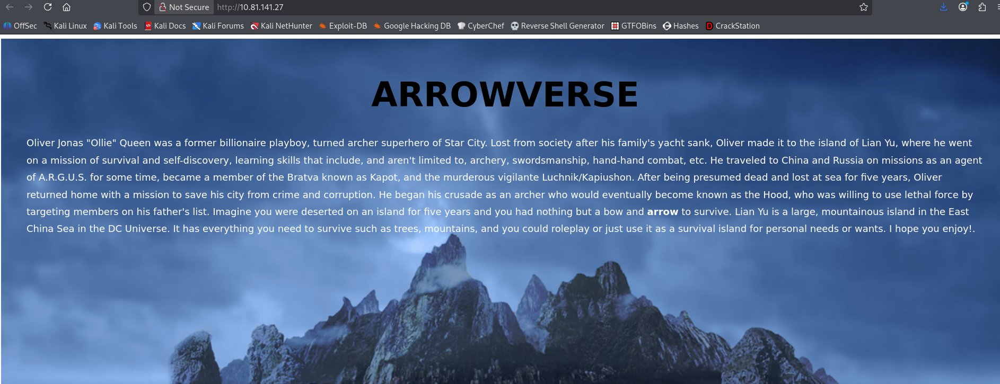

## 2. Web clues and FTP access

I enumerated web paths while browsing the site:

```bash
feroxbuster -u "http://$TARGET/" \
  -w /usr/share/seclists/Discovery/Web-Content/big.txt
```

This led to `/island/`. The page appeared to stop after “The Code Word is:”, but its HTML contained a heading styled white against a white background. Inspecting the page revealed the word `vigilante`. It was hidden visually; it was not an HTML comment.

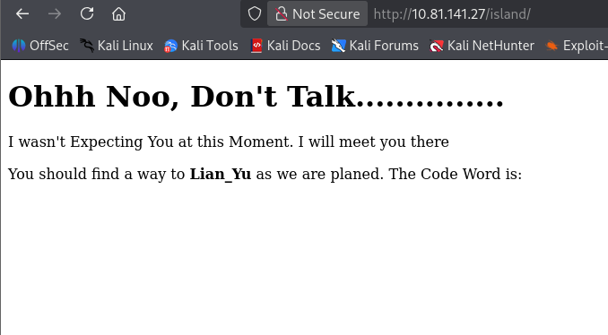

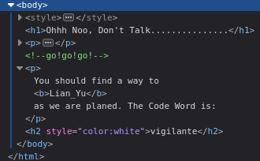

I enumerated below `/island/` and found `/island/2100/`:

```bash
feroxbuster -u "http://$TARGET/island/" \
  -w /usr/share/wordlists/dirbuster/directory-list-2.3-medium.txt
```

The HTML at `/island/2100/` contained a comment pointing to a `.ticket` file. I searched the directory again, this time adding that extension:

![[ticket-hint.png]]

```bash
feroxbuster -u "http://$TARGET/island/2100/" \
  -w /usr/share/wordlists/dirbuster/directory-list-2.3-medium.txt \
  -x .ticket
```

This found `/island/2100/green_arrow.ticket`. Its text described a token for the ship and supplied an encoded string. I tested the string in CyberChef; **From Base58** produced a candidate FTP password.

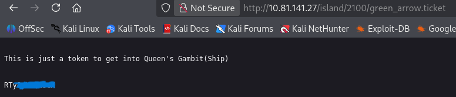

SSH did not accept the code word and decoded password combination. FTP accepted `vigilante` as the username and the decoded value as its password:

```bash
ftp "$TARGET"
# Username: vigilante
# Password: the Base58-decoded ticket value
```

The FTP listing contained `aa.jpg`, `Leave_me_alone.png`, and `Queen's_Gambit.png`. I downloaded the files with `get <filename>`. Moving to the parent directory also showed a `slade` account directory; I could not browse it over FTP, but the name became useful later.

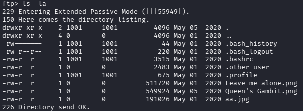

## 3. File analysis and SSH access

`Leave_me_alone.png` did not open as an image. I inspected its header in a hex editor and compared it with the [PNG signature](https://www.w3.org/TR/png-3/#5PNG-signature), which is `89 50 4E 47 0D 0A 1A 0A`. After correcting the signature bytes in a copy, the picture opened and displayed the word **password**.

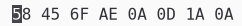

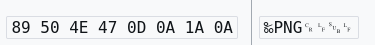

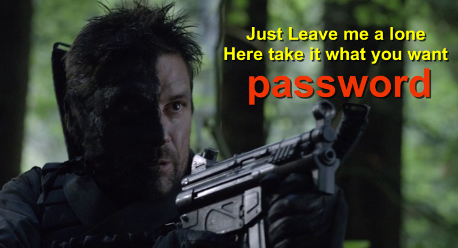

That clue gave me a passphrase to test against the other downloaded image, `aa.jpg`. I used `steghide` and entered the word **password** as passphrase when prompted:

```bash
steghide extract -sf aa.jpg
```

![[steg-extraction.png]]

It extracted `ss.zip`, which contained `passwd.txt` and `shado`:

![[zip-extraction.png]]

```bash
unzip ss.zip
cat passwd.txt
cat shado
```

`passwd.txt` contained more story text. `shado` contained a candidate password. I tried that password for the `slade` account discovered via FTP, and SSH accepted it.

```bash
ssh slade@"$TARGET"
id
```

The `id` output showed that I was logged in as `slade` (`uid=1000`). I then found `user.txt` in `/home/slade/`.

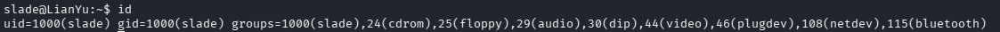

## 4. Privilege escalation

I checked what `slade` could run through `sudo`:

```bash
sudo -l
```

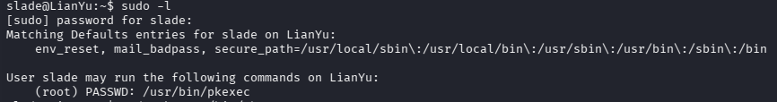

The output showed `(root) PASSWD: /usr/bin/pkexec`. `pkexec` accepts a command to execute, so permitting it as root let me start a shell([GTFOBins documents the shell behavior](https://gtfobins.org/gtfobins/pkexec/)):

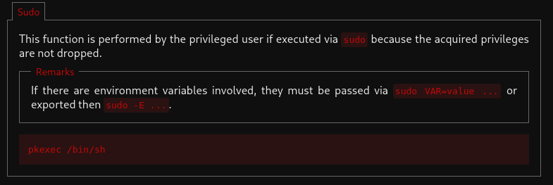

```bash
sudo /usr/bin/pkexec /bin/sh
id
```

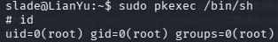

The resulting shell ran as root, and I could read `/root/root.txt`.

## Findings and fixes

| Observation                                                          | Why it mattered                                      | Defensive lesson                                                                                           |
| -------------------------------------------------------------------- | ---------------------------------------------------- | ---------------------------------------------------------------------------------------------------------- |
| Web pages exposed a code word and an encoded ticket                  | Together they led to an FTP credential.              | Encoding and visual hiding do not protect a secret. Avoid publishing access credentials in web content.    |
| The FTP account could download files containing another login secret | The files ultimately led to an SSH login as `slade`. | Keep authentication secrets out of accessible files; restrict account access and rotate exposed passwords. |
| `slade` could run `pkexec` as root via `sudo`                        | The permitted command launched a root shell.         | Grant narrowly scoped administrative actions instead of allowing a general command runner.                 |

The useful habit from this room was following each clue back to a concrete test: inspecting source when visible content looked incomplete, checking file signatures instead of trusting extensions, and verifying every credential against a specific service.

## References

- [TryHackMe: Lian_Yu](https://tryhackme.com/room/lianyu)
- [PNG specification: signature bytes](https://www.w3.org/TR/png-3/#5PNG-signature)
- [GTFOBins: `pkexec`](https://gtfobins.org/gtfobins/pkexec/)
