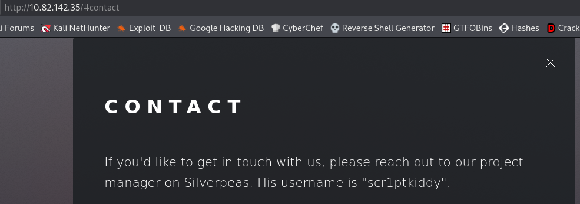
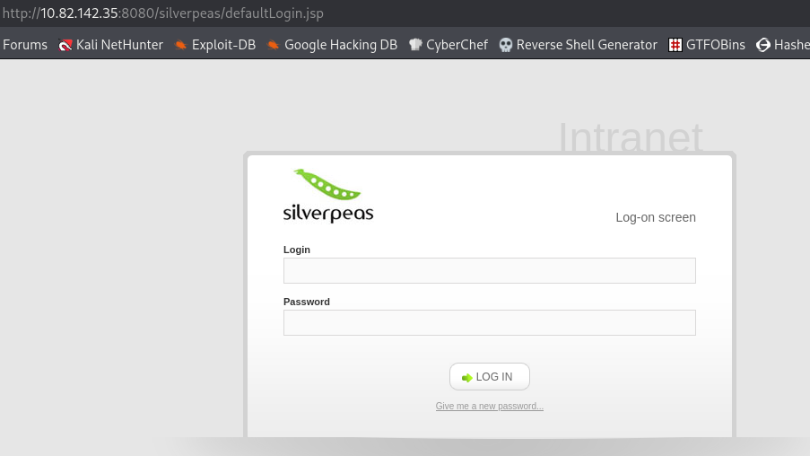
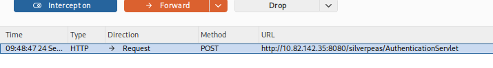
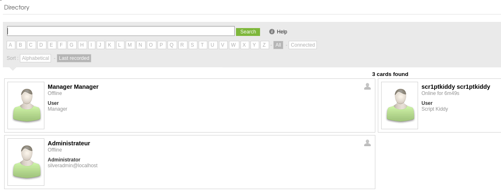
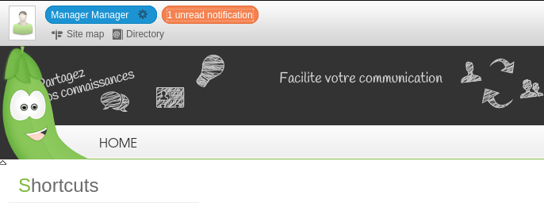
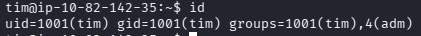
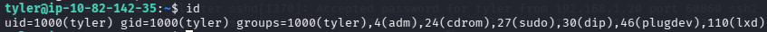
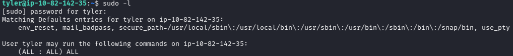

# SilverPlatter — TryHackMe write-up

**Platform:** [TryHackMe](https://tryhackme.com/room/colddboxeasy)  

**Difficulty:** Easy  

**Focus:** web enumeration, authentication bypass, credential discovery, log review, password reuse, sudo privilege escalation  

**Room author:** Tyler Ramsbey

## Summary

I found a Silverpeas login on port 8080 and used an authentication bypass to access two application accounts. A notification in the second account exposed SSH credentials for `tim`. On the host, `tim` belonged to the `adm` group, which let me read logs containing another credential. That password worked for `tyler`, whose unrestricted `sudo` access led to root.

## 1. Reconnaissance

I scanned all TCP ports and ran Nmap's default scripts and version detection:

```bash
nmap -Pn -p- -sV -sC --open <TARGET_IP>
```

| Port     | Nmap result   | What I confirmed                                                                                           |
| -------- | ------------- | ---------------------------------------------------------------------------------------------------------- |
| 22/tcp   | OpenSSH 8.9p1 | SSH login was available.                                                                                   |
| 80/tcp   | nginx 1.18.0  | A public website was running.                                                                              |
| 8080/tcp | `http-proxy`  | The port served a Silverpeas web application. The Nmap label alone does not establish that it was a proxy. |


On port 80, I browsed the site and enumerated paths with `feroxbuster`. I also ran `whatweb` to identify the visible web stack:

```bash
feroxbuster -u http://<TARGET_IP>/ -w /usr/share/wordlists/dirbuster/directory-list-2.3-medium.txt
whatweb http://<TARGET_IP>/
```

The contact section mentioned a project manager on **Silverpeas** and gave the username `scr1ptkiddy`. I treated Silverpeas as an application clue and the username as a possible account, rather than assuming either was a vulnerability.



I then enumerated port 8080:

```bash
feroxbuster -u http://<TARGET_IP>:8080/ \
  -w /usr/share/seclists/Discovery/Web-Content/DirBuster-2007_directory-list-lowercase-2.3-big.txt
```

`/website/` returned 403, and `/console` redirected to a page displaying 404. Those paths did not advance my access. I also tried SSH password guessing without success. Using the Silverpeas clue instead, I visited `http://<TARGET_IP>:8080/silverpeas/` and found its login page.



## 2. Silverpeas authentication bypass

I researched the identified application and found [CVE-2024-36042](https://nvd.nist.gov/vuln/detail/CVE-2024-36042). Silverpeas versions before 6.3.5 can authenticate a valid username when the `Password` parameter is **omitted** from a request to `AuthenticationServlet`. An empty or incorrect `Password` value is a different request. I did not obtain the installed version number from a banner; the behavior below was consistent with this CVE. The [original vulnerability report](https://gist.github.com/ChrisPritchard/4b6d5c70d9329ef116266a6c238dcb2d) explains how a missing password could be mistaken for an external authentication flow.

I submitted the known username `scr1ptkiddy` with an incorrect password, intercepted the login request in Burp Suite, and removed the `Password` field entirely. The form body became:

```http
POST /silverpeas/AuthenticationServlet HTTP/1.1
Content-Type: application/x-www-form-urlencoded

Login=scr1ptkiddy&DomainId=0
```

The screenshot below shows the request interception. The example above omits transient headers and session cookies; Burp handled the updated request length when forwarding it.




After forwarding the request, I reached the `scr1ptkiddy` session. This demonstrated unauthorized access to that account; it did **not** demonstrate superadmin access.


I inspected notifications and the user directory. The directory showed a `Manager` account and an administrator entry. Attempts to use the same technique for the administrator entry returned a technical error in this lab, so I cannot claim I compromised that account. The bypass did work for `Manager`.





## 3. Initial SSH access

In `Manager`'s notifications, I found a message containing SSH credentials for `tim`. I used those credentials to log in and read `user.txt` in `/home/tim/`:

```bash
ssh tim@<TARGET_IP>
id
cat /home/tim/user.txt
```



## 4. From tim to tyler

`sudo -l` reported that `tim` could not run commands through `sudo`. I checked scheduled jobs and SUID/SGID files, but those checks did not produce the path I used. The useful observation in `id` was membership in the `adm` group, which on this host allowed access to relevant log files.

```bash
sudo -l
cat /etc/crontab
find / -type f -perm -4000 2>/dev/null
find / -type f -perm -2000 2>/dev/null
find / -type f -group adm 2>/dev/null
grep -i 'pass' /var/log/auth.log.2
```

The last command found a log entry containing plaintext database configuration credentials for user `silverpeas`. A password from that entry did not work for the `silverpeas` SSH account. I listed the home directories to identify other local users and tried that password for `tyler`; SSH authentication succeeded:

```bash
ls -la /home
ssh tyler@<TARGET_IP>
```



This was a credential exposure followed by password reuse. Membership in `adm` was useful because it exposed the log; it did not itself give `tim` root access.

## 5. From tyler to root

As `tyler`, I ran `sudo -l`. It showed permission to run commands as root without a command restriction. I used `sudo -i` and read `/root/root.txt`:

```bash
sudo -l
sudo -i
id
cat /root/root.txt
```



## Findings and fixes

| Finding                                   | Evidence in this lab                                                                                | Recommended fix                                                                                                               |
| ----------------------------------------- | --------------------------------------------------------------------------------------------------- | ----------------------------------------------------------------------------------------------------------------------------- |
| Silverpeas authentication bypass          | Omitting `Password` gave access to `scr1ptkiddy` and `Manager`.                                     | Upgrade Silverpeas to **6.3.5 or later** and verify the fix. Review affected accounts and sessions.                           |
| Credentials in a Silverpeas notification  | `Manager`'s message disclosed `tim`'s SSH password.                                                 | Remove plaintext passwords from messages, rotate the exposed credential, and use a controlled secret sharing method.          |
| Credentials exposed through readable logs | `tim` could read `/var/log/auth.log.2` and found a plaintext password in logged configuration data. | Stop logging secrets, rotate the exposed credential, restrict access to retained logs, and review how that entry was written. |
| Password reuse across accounts            | A password found in the log worked for `tyler` over SSH.                                            | Use distinct passwords for service and user accounts, and rotate both affected credentials.                                   |
| Excessive `sudo` permission               | `tyler` could run arbitrary commands as root.                                                       | Limit `sudo` to the specific commands required for the account's job.                                                         |

The initial web page's username and product name were useful reconnaissance clues. Their presence alone was not the security failure: the compromise depended on the authentication bug and the later credential handling and privilege issues.

## References

- [NVD: CVE-2024-36042](https://nvd.nist.gov/vuln/detail/CVE-2024-36042)
- [Original CVE-2024-36042 vulnerability report](https://gist.github.com/ChrisPritchard/4b6d5c70d9329ef116266a6c238dcb2d)
